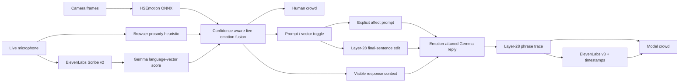

# NULL MIRROR

**A two-sided, multimodal emotion conversation you can see and hear.**

The left crowd visualizes the five-emotion mixture estimated from a person's
face, vocal energy, and words. Gemma replies with that uncertain context, its
layer-28 emotion-vector trace drives the right crowd phrase by phrase, and
ElevenLabs speaks the same measured delivery in sync.

This is not a chat box with an emotion badge. Every person in both 120-character
crowds changes color, face, gait, behavior, and particles as the mixture moves.

The interactive system explainer is available beside the demo at
[http://127.0.0.1:8766/how-it-works](http://127.0.0.1:8766/how-it-works). It walks
through sensing, uncertainty-aware fusion, selectable Gemma conditioning, the
layer-28 return trace, privacy boundaries, and the claims the project does not
make. The live affect-channel toggle compares explicit prompt context with an
experimental fused activation-steering vector injected into Gemma's layer-28
residual stream over the final user sentence.

## The 90-second judge proof

Open [http://127.0.0.1:8766/?demo=1](http://127.0.0.1:8766/?demo=1) and choose
**Open judge proof**. NULL MIRROR sends the same ambiguous transcript through
the same deterministic Gemma setup twice:

1. **Transcript only** — words-only control, with no face or voice context and
   no synthesized audio.
2. **+ Face & voice** — the selected, clearly labeled rehearsal signal changes
   the response context; this side also gets the expressive ElevenLabs voice.

Choose any stable preset: **happy**, **sad**, **angry**, **afraid**, or
**surprised**, then press **Prove it**. The comparison exposes both response
plans and replies, plus the measured fused-signal distribution shift. If the
context does not change either outcome, the UI says **same outcome** instead of
manufacturing a difference.

This is a controlled causal demonstration, not a sensor-accuracy claim. The
injected signals exist only under `?demo=1`, remain labeled throughout, and are
intended for repeatable rehearsal. The default URL remains the primary live
path: a real camera expression estimate, live browser-side voice-energy
heuristic, and a recorded utterance transcribed by ElevenLabs Scribe.

## The live loop



The shared contract is deliberately small and visually distinct:

| Emotion | Crowd color | Face label | Gemma vector |
| --- | --- | --- | --- |
| Happy | gold | Happiness | `happy` |
| Sad | blue | Sadness | `sad` |
| Angry | red | Anger | `angry` |
| Afraid | violet | Fear | `afraid` |
| Surprised | cyan | Surprise | `surprised` |

Neutral, contempt, and disgust from the face model are not relabeled. Their
excluded mass lowers confidence, so uncertainty remains visible.

## Why the sensors change the conversation

The face and voice signals are not decorative inputs. In **Prompt** mode, the
backend sends Gemma the fused affect plus a modality-by-modality summary. In
experimental **Vector** mode, it centers the five scores around 20%, scales the
weighted direction by fused confidence, and adds it to the final user sentence
at layer 28 without placing emotion labels or scores in the prompt. The current
transcript-vector scorer is capped at 35%
confidence until its five-label calibration improves, so it cannot overpower a
strong camera observation by itself. Negligible sensor readings are omitted.

The fused signal also selects a conservative default conversational strategy:
**celebrate** happiness, **support** sadness, **de-escalate** anger,
**reassure** fear, or **orient** surprise. This is deliberately not emotional
imitation: de-escalation, reassurance, and support use strategy-safe ElevenLabs
delivery instead of raw `shouts`, `sobbing`, or trembling tags. Materially
conflicting signals fall back to **stay curious** instead of asserting a mood.

Every response returns an audit-friendly context object. The right pane shows:

- a fused-context summary of what was sent to Gemma;
- how much fusion weight came from face and voice;
- whether nonverbal evidence reinforced, adjusted, shifted, or conflicted with
  the words-only reading; and
- the response strategy selected in Prompt mode, or the exact layer/token edit
  applied in Vector mode.

The built-in counterfactual makes this conditioning path inspectable without
asking the audience to trust that it happened. Its words-only control skips TTS
to keep the baseline conceptually clean; only the context-aware side speaks.

## Run the complete experience

Requirements: Python 3.12, `uv`, Node.js, `pnpm`, enough local memory for Gemma,
and an ElevenLabs API key for recorded speech and response audio.

```bash
cp gemma-emotion-vectors/.env.example gemma-emotion-vectors/.env
# Add ELEVENLABS_API_KEY to the new, git-ignored file.

make setup
make run
```

`make run` builds the React experience, loads Gemma once, and serves everything
from [http://127.0.0.1:8766](http://127.0.0.1:8766). The first run downloads the
Gemma/vector assets; the first successful face request lazily downloads the
HSEmotion ONNX model. Later runs use both caches.

For frontend iteration, run these in separate terminals:

```bash
make backend
make frontend
```

Vite opens on [http://127.0.0.1:5173](http://127.0.0.1:5173) and proxies `/api`
to the warm backend.

## Demo controls

- Press **Start camera + microphone** to opt into live sensors.
- Press **Speak to the mirror**, speak naturally, then stop the recording.
- Use the compact **Prompt / Vector** toggle above the text field to choose the
  affect channel for typed, recorded, and counterfactual turns.
- If camera or microphone access is unavailable, use the typed fallback.
- For repeatable stage rehearsal, open `/?demo=1`, choose **Open judge proof**,
  select one of the five emotion presets, and press **Prove it**. The injected
  input is permanently labeled and never activates without that query.
- **Use live camera + microphone** remains available from the proof landing
  screen so judges can move directly from the control to the real experience.
- If browser autoplay is blocked, the response remains available through the
  visible audio control and play button.

## What each signal means

- **Face** is an HSEmotion eight-class expression estimate projected onto the
  shared five. It is evidence about a visible expression, not a fact about a
  person's inner state.
- **Voice energy** is a conservative browser-side prosody heuristic using
  loudness, pitch movement, spectral centroid, and onset relative to a rolling
  baseline. It stays in the browser and is labeled as a heuristic in the UI.
- **ElevenLabs** performs Scribe transcription after recording stops and TTS for
  the response. It does not produce the live prosody estimate.
- **Words** are compared with the same published Gemma emotion directions used
  for the response trace. This experimental scorer is deliberately confidence
  capped; face and voice remain able to change the response context.
- **Gemma phrase scores** are calibrated vector alignments, not probabilities
  and not a claim that the model has subjective feelings. Selection happens
  inside the shared-five contract when that channel independently clears the
  evidence threshold, even if one of Gemma's richer diagnostic vectors is
  stronger. The UI separately displays shared-five coverage. Weak evidence
  stays untagged instead of being forced into a color or ElevenLabs direction.

## Privacy and graceful degradation

- Camera frames are downscaled and sent only to the local backend by default;
  they are processed in memory and not retained.
- Live prosody features stay in the browser.
- A recorded utterance is sent to ElevenLabs Scribe only after the user presses
  stop. Generated response text is sent to ElevenLabs for speech synthesis.
- Typed conversation works without ElevenLabs. Missing providers and model
  failures are shown explicitly; the normal experience never substitutes fake
  data.

## Stage warm-up checklist

Do this before the venue network or presentation clock becomes a variable:

1. On a reliable connection, run `make setup`, then `make test`.
2. Run `make run` at least once before demo day. The first model load downloads
   roughly **15 GB** of Gemma assets into the Hugging Face cache, plus the vector
   archive and face model. Do not make the first download on stage.
3. After the assets are cached, use `make run-offline` for the stage and wait
   for the terminal's **Model ready** message before opening the experience.
   This keeps Gemma loaded between turns and prevents Hugging Face metadata
   checks from depending on venue Wi-Fi. Use `make backend-offline` when you do
   not want the launcher to open a browser.
4. At the venue, verify one live recorded turn at the default URL (including a
   successful face reading, which also warms the lazily loaded HSEmotion ONNX
   asset), then open `/?demo=1` and run one complete **Open judge proof**
   comparison.
5. Confirm response audio can play in the presentation browser. If autoplay is
   blocked, use the visible play control once before the pitch.

The offline targets require the Gemma and vector assets to be cached already.
ElevenLabs transcription and TTS still require a working network connection
and valid key; without them, typed Gemma responses still work but the live
speech loop and adapted proof voice do not.

## Validate

```bash
make test
```

The suite covers taxonomy projection, uncertainty-aware fusion, centered
activation steering, targeted residual edits, weak phrase evidence, HSEmotion
class mapping, request validation, Scribe multipart calls, timestamped
ElevenLabs speech, the conversation contract, and a production TypeScript/Vite
build.

## Repository map

- [`experience/`](experience/) — React/Three.js human-simulation experience.
- [`gemma-emotion-vectors/`](gemma-emotion-vectors/) — Gemma trace, FastAPI,
  face inference, fusion, transcription, and speech.
- [`THIRD_PARTY_NOTICES.md`](THIRD_PARTY_NOTICES.md) — attribution and model/API
  provenance.

The crowd frontend is based on Daniel Cerasi's MIT-licensed
[`dc-121/null-hackathon`](https://github.com/dc-121/null-hackathon), with its
license retained under [`experience/LICENSE`](experience/LICENSE). The upstream
unlicensed DDAMFN checkpoint/code path is intentionally not included; this
integration uses the licensed HSEmotion/OpenCV stack instead.
