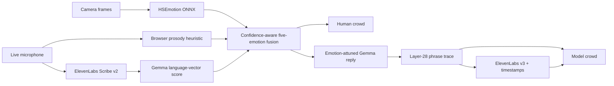

# NULL MIRROR

**A two-sided, multimodal emotion conversation you can see and hear.**

The left crowd visualizes the five-emotion mixture estimated from a person's
face, vocal energy, and words. Gemma replies with that uncertain context, its
layer-28 emotion-vector trace drives the right crowd phrase by phrase, and
ElevenLabs speaks the same measured delivery in sync.

This is not a chat box with an emotion badge. Every person in both 120-character
crowds changes color, face, gait, behavior, and particles as the mixture moves.

## The live loop



The shared contract is deliberately small and visually distinct:

| Emotion | Crowd color | Face label | Gemma vector |
| --- | --- | --- | --- |
| Happy | gold | Happiness | `happy` |
| Sad | blue | Sadness | `sad` |
| Angry | red | Anger | `angry` |
| Afraid | violet | Fear | `afraid` |
| Surprised | cyan | Surprise | `surprised` |

Neutral, contempt, and disgust from the face model are not relabeled. Their
excluded mass lowers confidence, so uncertainty remains visible.

## Run the complete experience

Requirements: Python 3.12, `uv`, Node.js, `pnpm`, enough local memory for Gemma,
and an ElevenLabs API key for recorded speech and response audio.

```bash
cp gemma-emotion-vectors/.env.example gemma-emotion-vectors/.env
# Add ELEVENLABS_API_KEY to the new, git-ignored file.

make setup
make run
```

`make run` builds the React experience, loads Gemma once, and serves everything
from [http://127.0.0.1:8766](http://127.0.0.1:8766). The first run downloads the
Gemma/vector assets and the HSEmotion ONNX model; later runs use their caches.

For frontend iteration, run these in separate terminals:

```bash
make backend
make frontend
```

Vite opens on [http://127.0.0.1:5173](http://127.0.0.1:5173) and proxies `/api`
to the warm backend.

## Demo controls

- Press **Start camera + microphone** to opt into live sensors.
- Press **Speak to the mirror**, speak naturally, then stop the recording.
- If camera or microphone access is unavailable, use the typed fallback.
- For hardware-free stage rehearsal, open `/?demo=1`. The generated input is
  permanently marked **DEMO SIGNAL** and never activates without that query.
- If browser autoplay is blocked, the response remains available through the
  visible audio control and play button.

## What each signal means

- **Face** is an HSEmotion eight-class expression estimate projected onto the
  shared five. It is evidence about a visible expression, not a fact about a
  person's inner state.
- **Voice energy** is a conservative browser-side heuristic using loudness,
  pitch movement, spectral centroid, and onset relative to a rolling baseline.
  It is labeled as a heuristic in the UI.
- **Words** are compared with the same published Gemma emotion directions used
  for the response trace.
- **Gemma phrase scores** are calibrated vector alignments, not probabilities
  and not a claim that the model has subjective feelings. Weak evidence stays
  untagged instead of being forced into a color or ElevenLabs direction.

## Privacy and graceful degradation

- Camera frames are downscaled and sent only to the local backend by default;
  they are processed in memory and not retained.
- Live prosody features stay in the browser.
- A recorded utterance is sent to ElevenLabs Scribe only after the user presses
  stop. Generated response text is sent to ElevenLabs for speech synthesis.
- Typed conversation works without ElevenLabs. Missing providers and model
  failures are shown explicitly; the normal experience never substitutes fake
  data.

## Validate

```bash
make test
```

The suite covers taxonomy projection, uncertainty-aware fusion, weak phrase
evidence, HSEmotion class mapping, request validation, Scribe multipart calls,
timestamped ElevenLabs speech, the conversation contract, and a production
TypeScript/Vite build.

## Repository map

- [`experience/`](experience/) — React/Three.js human-simulation experience.
- [`gemma-emotion-vectors/`](gemma-emotion-vectors/) — Gemma trace, FastAPI,
  face inference, fusion, transcription, and speech.
- [`THIRD_PARTY_NOTICES.md`](THIRD_PARTY_NOTICES.md) — attribution and model/API
  provenance.

The crowd frontend is based on Daniel Cerasi's MIT-licensed
[`dc-121/null-hackathon`](https://github.com/dc-121/null-hackathon), with its
license retained under [`experience/LICENSE`](experience/LICENSE). The upstream
unlicensed DDAMFN checkpoint/code path is intentionally not included; this
integration uses the licensed HSEmotion/OpenCV stack instead.
